# Connected vehicle companion

**A connected electric-vehicle companion app, with a working backend and a separate vehicle simulator.**

> **Independent connected-vehicle system. Every vehicle in it is simulated.
> Not affiliated with any vehicle manufacturer.**

Three programs, one system:

| | |
|---|---|
| **Mobile app** — React Native / Expo | Screens, map, articulated 3D vehicle, controls |
| **API and console** — Next.js on Vercel | Authenticated HTTP API and a protected simulator console |
| **Vehicle simulator** — shared TypeScript | Owns the simulated vehicle's behaviour; runs in a browser tab or headless in Node |

The mobile app **requests**; a separate simulator process **executes**; the backend
**validates, persists and broadcasts**. State reaches the app over a private Supabase
Realtime channel and drives the map, the controls and the animations. The app cannot
write vehicle state and has no code path that could.

The vehicle is an **articulated 3D model** whose doors, tailgate, bonnet, charge flap
and light surfaces are driven entirely by reported state — see
[`docs/ASSETS.md`](docs/ASSETS.md) for the asset, its articulation mapping, and the one
asset limitation that remains.

<p align="center">
  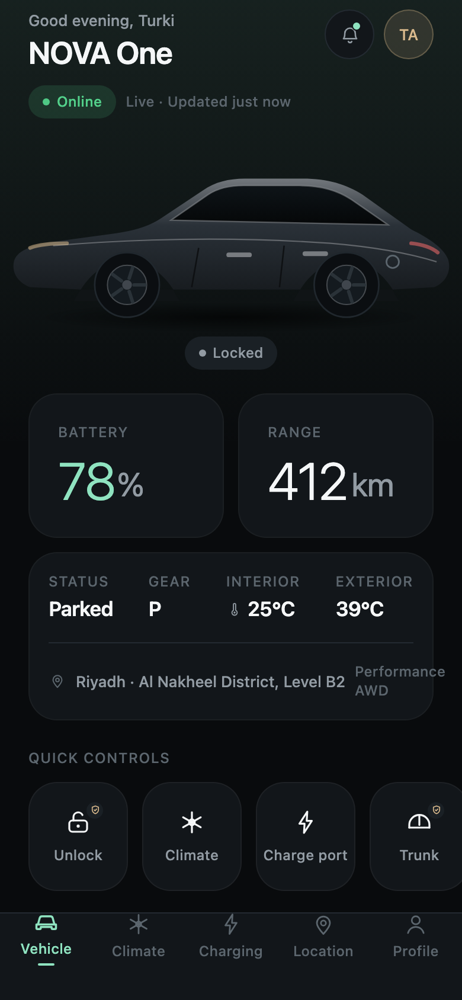
  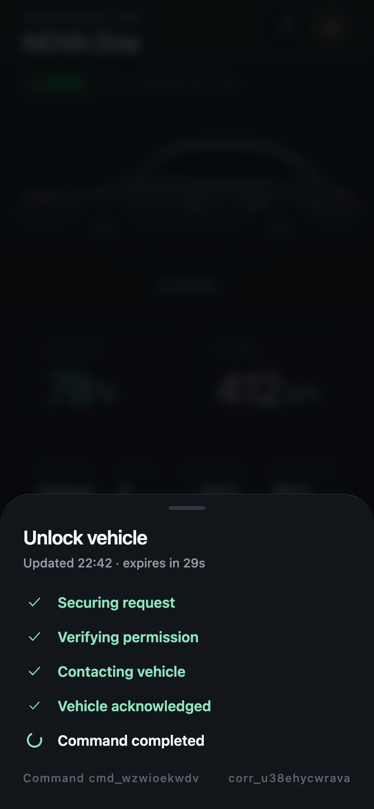
  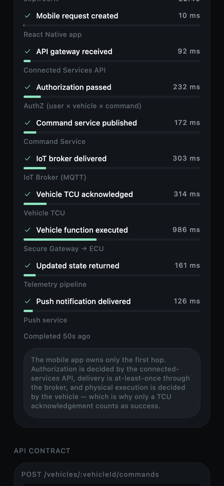
</p>

---

## Contents

1. [What this is and is not](#1-what-this-is-and-is-not)
2. [Setup and run](#2-setup-and-run)
2b. [The backend, the simulator and deployment](#2b-the-backend-the-simulator-and-deployment)
3. [Architecture](#3-architecture)
4. [Feature map](#4-feature-map)
5. [The mock connected cloud](#5-the-mock-connected-cloud)
6. [Security boundaries](#6-security-boundaries)
7. [Native integration roadmap](#7-native-integration-roadmap)
8. [Five-minute demonstration script](#8-five-minute-demonstration-script)
9. [Testing](#9-testing)
10. [Known limitations](#10-known-limitations)
11. [Screenshots](#11-screenshots)

---

## 1. What this is and is not

Read this section first. Every claim the app makes about itself is bounded by it.

| | |
|---|---|
| **Remote commands** | Travel a **real network path**: the app POSTs to an authenticated API, the command is persisted in Postgres, a **separate simulator process** claims and executes it, and the result comes back over a private realtime channel. No real vehicle is contacted — the thing at the far end is a simulator, not a car. |
| **The vehicle** | Is **simulated**, always, and labelled as such. Driving a physical vehicle requires an authorized OEM API or telematics interface, which is a commercial agreement rather than a piece of code. |
| **Digital Key** | Uses **simulated local proximity adapters**. No real BLE, UWB or NFC hardware is used, and no cryptography is performed. The screens model the *lifecycle and trust boundaries*, not the radio. |
| **React Native's role** | Owns the **shared customer experience** — every screen, every piece of state presentation, every domain rule. |
| **Native modules' role** | Would own the **sensitive device integrations**: biometrics, hardware-backed storage, BLE/UWB/NFC, wallet provisioning, device attestation. |
| **The vehicle's role** | Remains the **authority for physical execution**. The app requests; the vehicle decides; only a vehicle acknowledgement is treated as success. |
| **Affiliation** | This is an **independent concept**, not affiliated with or endorsed by any automaker. All visual assets, including the vehicle rendering and the full icon set, are original. |

---

## 2. Setup and run

**Requirements:** Node 20+, npm 10+. iOS Simulator (Xcode) or Android Emulator optional.

The fastest look at the running system is the deployed console — see
[Try it without signing up](#try-it-without-signing-up).

The app runs in one of two modes, and it tells you which:

| Mode | When | What you get |
|---|---|---|
| **Local fixtures** | No `EXPO_PUBLIC_*` variables set | The original in-process simulation. Everything works, nothing leaves the device. |
| **Connected** | All three set | Supabase Auth, the Next.js API, and a separate vehicle simulator. |

### Local fixtures — nothing to configure

```bash
npm install
npm run web        # browser — fastest way to see everything
npm run ios
npm run android
```

Quality gates:

```bash
npm run type-check   # tsc --noEmit, strict mode
npm run lint
npm test             # jest
```

---

## 2b. The backend, the simulator and deployment

### What each piece is

```
React Native app ──POST /api/vehicles/:id/commands──▶ Next.js API ──▶ Postgres
        ▲                                                                │
        │                                                    command row │ queued
        │                                                                ▼
        │                                             Vehicle simulator (browser or Node)
        │                                             claim ▸ execute ▸ report result
        │                                                                │
        └────── Supabase Realtime, private channel vehicle:<id> ◀─────────┘
                        (published by database triggers)
```

The app occupies the first hop only. The simulator owns the vehicle's behaviour.
The backend validates and persists; it never invents state.

### 1. Database

Migrations live in [`supabase/migrations/`](supabase/migrations) and are numbered in
apply order:

| | |
|---|---|
| `0001` | `vehicles`, `vehicle_members`, membership predicates |
| `0002` | `vehicle_state` — one current row per vehicle, with the staleness guard |
| `0003` | `vehicle_commands` — idempotency, atomic claim, transactional result |
| `0004` | `simulator_sessions` — short-lived, vehicle-bound, one active per vehicle |
| `0005` | Realtime broadcast triggers and private-channel authorization |
| `0006` | First-run vehicle provisioning |
| `0007` | Closes the privileged functions to clients |
| `0008` | Expiry against the wall clock |

Apply them with the Supabase CLI:

```bash
supabase link --project-ref <your-project-ref>
supabase db push
```

or paste each file into the SQL editor, in order.

> **`0005` needs a note.** `realtime.messages` is owned by `supabase_realtime_admin`.
> Adding a policy to it works; `ALTER TABLE` on it does not, and is not needed — RLS is
> already enabled there on a hosted project.

### Try it without signing up

| | |
|---|---|
| **Console** | https://car-connectivity.vercel.app — press **Open the demo vehicle** |
| **Account** | `demo@carconnectivity.app` / `demo-vehicle-2026` |

The same button exists on the mobile sign-in screen in connected mode, so the app
and the console open the same simulated car. It is an ordinary account with
ordinary permissions — it authenticates through Supabase Auth and sees only its
own vehicle — not a bypass.

**A two-minute demonstration**

1. Open the console, press **Open the demo vehicle**, then **Start simulation**.
   Telemetry begins flowing every two seconds.
2. In the app, tap **Unlock**. It shows pending, the console logs the claim, and
   the lock only changes once the vehicle confirms.
3. Press **Start journey** in the console. It refuses — the vehicle is not ready
   to drive.
4. In the app, **Enable EV power**. The vehicle reports ready and stays parked.
5. Press **Start journey** again. The map moves, heading and speed following the
   route.
6. Tick **Simulate connectivity loss**. The app stops receiving reports and shows
   its last known state with an age, rather than a frozen live view.

### Deployment

| | |
|---|---|
| **Live** | https://car-connectivity.vercel.app |
| **Simulator console** | https://car-connectivity.vercel.app/simulator |
| **Vercel project** | `car-connectivity`, root directory `web`, linked to this repository |
| **Supabase project** | `Car-connectivity` (`prcnihieupchvarwwmdf`) |

All three environment variables are set on the Vercel project.
`SUPABASE_SECRET_KEY` is stored as a sensitive variable: server-side only, never
committed, and not readable back from the dashboard.

To verify a deployment end to end:

```bash
cd web
npm run verify:deployment
```

That script uses nothing but HTTP — the same path the app takes — and checks
authentication, isolation between accounts, telemetry staleness, idempotency,
claim-exactly-once, expiry and session displacement.

### 2. The Next.js app

```bash
cd web
npm install
cp .env.example .env.local     # fill in the three values
npm run dev                    # http://localhost:3000
```

| Variable | Where it may go |
|---|---|
| `NEXT_PUBLIC_SUPABASE_URL` | Anywhere |
| `NEXT_PUBLIC_SUPABASE_PUBLISHABLE_KEY` | Anywhere. Bounded by RLS. |
| `SUPABASE_SECRET_KEY` | **Server only.** Bypasses RLS, which is why every handler authorizes explicitly before using it. |

Quality gates:

```bash
npm run type-check
npm run test         # vitest
npm run build
```

### 3. The simulator

**In a browser** — sign in at `/`, open `/simulator`, pick your vehicle, press
**Start simulation**. The page is clearly labelled as a simulated vehicle. It offers
start/stop, start/pause journey, live reported state, incoming commands and results,
battery and outside-temperature sliders, cruising speed, command delay, a
refuse-every-command switch, and simulated connectivity loss.

**Headless**, using the same modules:

```bash
cd web
# .env.local also needs SIMULATOR_EMAIL / SIMULATOR_PASSWORD
npm run simulator
SIMULATOR_JOURNEY=1 npm run simulator   # start driving immediately
```

Either way the simulator reports telemetry every two seconds and polls for
commands every second. The browser runs the loop; Vercel only serves the page and
answers finite API requests — there is no endless loop inside a route handler.

### 4. The mobile app, connected

```bash
cp .env.example .env    # in the repository root
```

```
EXPO_PUBLIC_API_URL=http://localhost:3000
EXPO_PUBLIC_SUPABASE_URL=https://<ref>.supabase.co
EXPO_PUBLIC_SUPABASE_PUBLISHABLE_KEY=sb_publishable_...
```

A physical device needs your machine's LAN address rather than `localhost`.

```bash
npm run web        # or ios / android
```

Sign in with the account you created in the console — the first API call provisions a
simulated vehicle and makes you its owner.

### 5. Native builds

Native distribution is separate from the Vercel deployment.

```bash
npm install -g eas-cli
eas login
eas build:configure
eas build --profile preview  --platform ios
eas build --profile production --platform android
```

[`eas.json`](eas.json) carries the profiles; set `EXPO_PUBLIC_API_URL` in each to the
deployed URL.

### 6. Auth redirects

In **Supabase → Authentication → URL Configuration** add:

* `https://<your-vercel-deployment>` and `https://<your-vercel-deployment>/simulator`
* `novadrive://` — the app's scheme, for mobile deep links

---

## 3. Architecture

### The pipeline being modelled

```
Mobile App  →  Connected Services API  →  Command Service  →  IoT Broker
            →  Vehicle TCU  →  Secure Gateway  →  Vehicle ECU
```

The app occupies the first hop only. Everything downstream is simulated, but it is
simulated *as a pipeline* — each hop has its own latency, its own failure mode and its
own entry in the command trace.

### Code layout — feature-first Clean Architecture

```
src/
├── app/                        Expo Router routes only; no business logic
│   ├── (onboarding)/           welcome, sign-in, pair, permissions, digital-key
│   ├── (tabs)/                 vehicle, climate, charging, location, profile
│   ├── developer/              simulation panel, E2E trace
│   └── digital-key, drivers, health, ota, notifications, security, vehicles, about, help
│
├── domain/                     Pure TypeScript. No React, no I/O, fully unit-tested.
│   ├── entities/               VehicleCommand, VehicleState, DigitalKey, SharedDriver…
│   ├── use-cases/              command state machine, idempotency, authorization,
│   │                           charging rules, key lifecycle, access rules, OTA rules
│   └── repositories/           interfaces the app depends on — the swap seam
│
├── infrastructure/             Everything that talks to the outside world
│   ├── api/                    composition root + API contract + fleet metrics
│   ├── mock-connected-cloud/   implements every repository interface
│   ├── command-simulator/      the pipeline, timing profiles, state transitions
│   ├── telemetry-simulator/    physical effects + ambient telemetry drift
│   ├── secure-storage/         SecureStore abstraction with a web fallback
│   └── native-connectivity/    typed adapters: biometric, BLE, UWB, NFC, wallet, attestation
│
├── components/
│   ├── design-system/          Text, Surface, Pressable, Button, Slider, Sheet, Icon…
│   ├── vehicle/                VehicleRender, BatteryArc, CabinView, MapCanvas
│   └── feedback/               CommandSheet, Banner, EmptyState
│
├── features/                   Screen-level composition (control tray, stat set, demo overlay…)
├── stores/                     Zustand: app, vehicle, command, simulation, demo, ui
├── hooks/                      TanStack Query + command orchestration
├── i18n/                       Typed EN/AR catalogue + RTL helpers
├── theme/                      Design tokens + ThemeProvider
├── utils/                      ids, time, redacting logger, formatting
└── tests/                      91 unit + integration + component tests
```

### The dependency rule

`app` → `features` → `hooks` → `domain` ← `infrastructure`

Screens and use-cases depend only on **interfaces** in `domain/repositories`. The mock
cloud implements them today. Swapping in a real OEM client is a change to
[`src/infrastructure/api/index.ts`](src/infrastructure/api/index.ts) **only**:

```ts
const client = new ConnectedServicesClient({ baseUrl, tokenProvider });
export const vehicleRepository: VehicleRepository = client.vehicles;
export const commandRepository: VehicleCommandRepository = client.commands;
```

No screen, store, hook or domain rule changes.

### State ownership — the rule that makes the app trustworthy

There are three kinds of state, and they are deliberately kept apart:

| State | Owner | Who may write it |
|---|---|---|
| **Authoritative vehicle state** | `useVehicleStore` | **Only** the telemetry subscription. Never the UI. |
| **Command progress** | `useCommandStore` | Only the command pipeline. |
| **App preferences** | `useAppStore` | The UI. |

Because nothing in the UI can write vehicle state, **the interface is structurally
incapable of showing a state the vehicle has not reported.** No optimistic lock toggle
is possible, because there is no code path for one.

### The command state machine

`src/domain/use-cases/command-state-machine.ts`

```
requested → validating → queued → delivered → executing → confirmed
     ↓           ↓          ↓          ↓           ↓
   rejected / failed / expired   (all terminal, no outgoing transitions)
```

* Transitions are **forward-only**, and terminal states accept nothing.
* A repeat of the current status is an **idempotent no-op** — MQTT is at-least-once, so
  duplicate deliveries are expected and must not re-animate a finished command.
* An **illegal transition is refused, not applied**. A client/cloud disagreement means
  guessing would risk showing "Unlocked" for a locked car.
* `confirmed` is the **only** status rendered as success.

### Connectivity model

| Mode | Behaviour |
|---|---|
| **Online** | Validation ~300–600 ms, delivery ~500–1200 ms, execution ~700–1500 ms |
| **Asleep** | "Waking vehicle" for 3–7 s, then executes normally |
| **Poor signal** | ×2.6 latency, high jitter, ~34% timeout — retryable with the same idempotency key |
| **Offline** | Never reports success. Shows last-known state with its age. High-risk commands **expire** rather than queue |
| **Service mode** | Restricted commands rejected with a clear reason |

### Capability-driven UI

Every vehicle reports a `VehicleCapabilities` profile, and the UI adapts to it. Three demo
vehicles exist specifically to prove this:

| | My vehicle (Long Range) | Second vehicle (RWD) | Fleet vehicle |
|---|---|---|---|
| Software | 4.8.2 | 3.2.9 | 2.7.4 |
| Remote trunk | ✅ | ❌ | ❌ |
| Remote climate | ✅ | ✅ | ❌ |
| Charge scheduling | ✅ | ❌ | ❌ |
| Digital Key | UWB + BLE + NFC | BLE + NFC | None |
| OTA | ✅ | ❌ | ❌ |

Switch between them in **Profile → Vehicles**. Controls disappear, screens explain
themselves, and nothing breaks. Unsupported features are hidden or disabled **with a
stated reason** — never left as dead buttons.

---

## 4. Feature map

| Area | What it does | Where |
|---|---|---|
| **Onboarding** | Welcome with cinematic reveal · sign-in (RHF + Zod, biometrics, demo account) · VIN pairing with server-side ownership validation · contextual permissions · Digital Key invitation | `app/(onboarding)/` |
| **Vehicle home** | Greeting, connectivity pill, freshness timestamp · vehicle hero with scroll parallax, state-driven visuals and tap hotspots · battery, range, gear, temperatures, location · quick-control tray · command history | `app/(tabs)/vehicle.tsx` |
| **Remote commands** | Lock/unlock, climate, temperature, trunk, charging, flash, horn — each with press state, haptics, biometric step-up, pending/confirmed/failed states, retry, command ID, correlation ID and expiry | `features/remote-controls/`, `components/feedback/CommandSheet.tsx` |
| **Climate** | Top-down cabin visualisation · dual-zone targets · seat heating/ventilation · steering wheel · front/rear defrost · airflow · departure preconditioning · battery-impact estimate | `app/(tabs)/climate.tsx` |
| **Charging** | Battery arc · live power/added range/completion · charge-limit slider · start/stop with **honest preconditions** · scheduling · off-peak recommendation · recent sessions · six simulated charge states | `app/(tabs)/charging.tsx` |
| **Location** | Procedurally-generated dark map (no API key) · heading marker · **live vs last-known distinction** · navigate/flash/horn · valet mode · geofence · privacy explanation | `app/(tabs)/location.tsx` |
| **Digital Key** | BLE/UWB/NFC explained · six key states · seven-step provisioning ceremony · phone/watch/key card/shared keys · suspend, revoke, expiry · security-boundary explanation | `app/digital-key.tsx` |
| **Drivers & sharing** | Invite with six granular permissions · permanent / date-range / one-time / valet · effective-permission computation · append-only audit trail | `app/drivers.tsx` |
| **Vehicle health** | Overall status · tyre pressures with deviation · battery health · software · connectivity · service due · normalized warnings (no raw CAN) | `app/health.tsx` |
| **OTA** | Release notes · system prerequisites from live state · user acknowledgement · download → verify → install → complete, with rollback guidance | `app/ota.tsx` |
| **Notifications** | Nine categories · unread badge · per-category preferences · correlation IDs on command notifications | `app/notifications.tsx` |
| **Security** | Biometric step-up policy · trusted devices with attestation status · active sessions · security activity log | `app/security.tsx` |
| **Developer** | Simulation panel (connectivity, charging scenarios, motion, biometric failure injection, live state) · E2E trace with per-hop timings · fleet metrics | `app/developer/` |
| **Vehicle visualisation** | Articulated glTF model shared by Home, Controls, Climate and Garage · hinge animation driven by reported state · projected hotspots · camera presets | `components/vehicle-3d/` |
| **Presenter mode** | Ten-step guided track with presenter notes. **Developer tool, off by default**, never shown on authentication or onboarding | `features/demo/DemoOverlay.tsx` |
| **i18n** | Typed EN/AR catalogue · compile-time completeness · **instant RTL with no app restart** | `i18n/` |

---

## 5. The mock connected cloud

[`src/infrastructure/mock-connected-cloud/cloud.ts`](src/infrastructure/mock-connected-cloud/cloud.ts)

A single `MockConnectedCloud` object implements **all seven repository interfaces**. It:

* owns authoritative vehicle state for three vehicles;
* runs the `CommandSimulator`, which walks each command through nine pipeline hops;
* drifts telemetry every 3 seconds — cabin temperature converges toward target, state of
  charge rises while plugged in, climate draws ~3.5 kW, `lastUpdatedAt` advances;
* stops sending telemetry entirely when the vehicle is offline, so the snapshot
  **visibly goes stale** rather than silently freezing;
* emits notifications on terminal command outcomes, the way a push service would.

### API contract mirrored

```
GET    /vehicles
GET    /vehicles/:vehicleId
GET    /vehicles/:vehicleId/state
GET    /vehicles/:vehicleId/capabilities
GET    /vehicles/:vehicleId/telemetry
GET    /vehicles/:vehicleId/charging
POST   /vehicles/:vehicleId/commands
GET    /vehicles/:vehicleId/commands/:commandId
GET    /vehicles/:vehicleId/digital-keys
POST   /vehicles/:vehicleId/digital-keys
DELETE /vehicles/:vehicleId/digital-keys/:keyId
```

Request:

```json
{
  "type": "unlock",
  "idempotencyKey": "idem_ly7f2k_a91cd3e0",
  "requestedAt": "2026-09-09T18:41:02.334Z",
  "expiresInSeconds": 30
}
```

Response — **202 Accepted**, an acknowledgement of the *request*, not of the *action*:

```json
{
  "commandId": "cmd_123",
  "correlationId": "corr_456",
  "status": "validating",
  "vehicleId": "nova_one_demo"
}
```

### Idempotency

A retry **reuses the original idempotency key** and issues a **fresh correlation ID**.
The key identifies the *intent*; the correlation ID identifies the *attempt*. Without
this, tapping "Retry" on a request that actually succeeded but whose response was lost
would unlock the car a second time.

---

## 6. Security boundaries

| Principle | How it is enforced here |
|---|---|
| Vehicle state is safety-sensitive | The UI cannot write it. Only the telemetry subscription can. |
| Never show success without confirmation | `confirmed` is the only success status; physical effects are applied in one place, gated on it |
| Never expose private keys | No key material exists in JS. `credentialRef` is a public identifier for revocation only |
| Short-lived expiry | 30 s for unlock and trunk; expiry is re-checked at **every** pipeline hop |
| Replay protection | A single-use nonce is generated per command (`utils/id.ts`) with the production design documented |
| Idempotent retries | Same key, new correlation ID |
| Per user × vehicle × command authorization | `domain/use-cases/authorize-command.ts` — a client-side *courtesy* check; the server remains the decision-maker |
| Biometric step-up | Required for high-risk commands, user-configurable, with a warning when disabled |
| Cached vs live state | `isCached` and `location.isLive` flags drive explicit "Last known location" labelling |
| Audit events | Every access change appends an immutable audit entry |
| Redaction | `utils/logger.ts` strips VINs, emails and phone numbers, and coarsens coordinates to ~1 km before anything is logged |
| TLS / mTLS assumed | Documented as a transport concern; certificates are a vehicle-and-cloud matter, not a client one |
| Attestation hooks | `DeviceAttestationAdapter` — the backend verifies, never the app |
| No real vehicle control | The entire downstream is a simulation |

**What is stored where**

| Data | Location |
|---|---|
| Session tokens, full VIN, pairing references | `SecureStorageAdapter` → Keychain / Keystore. **In-memory only on web**, wiped on reload — never `localStorage` |
| Digital Key private material | Secure Enclave / StrongBox / eSE. **Never** in JavaScript, Zustand, AsyncStorage, source or git |
| Displayed VIN | Last four characters only |

---

## 7. Native integration roadmap

Every adapter in [`src/infrastructure/native-connectivity/types.ts`](src/infrastructure/native-connectivity/types.ts)
is a typed interface with a simulation implementation today.

| Adapter | iOS | Android | Gating |
|---|---|---|---|
| `BiometricAdapter` | LocalAuthentication (Swift) | BiometricPrompt + StrongBox (Kotlin) | — *(real OS prompt already wired on device)* |
| `SecureStorageAdapter` | Keychain, `WhenUnlockedThisDeviceOnly` | EncryptedSharedPreferences + Keystore | — *(already real on device)* |
| `BluetoothAdapter` | CoreBluetooth | BluetoothLeScanner | Vehicle-side pairing + OEM service UUID |
| `UwbAdapter` | NearbyInteraction (U1/U2 chip) | `androidx.core.uwb` | Hardware support + vehicle UWB anchors |
| `NfcAdapter` | CoreNFC / Wallet express mode | HostApduService (HCE) | — |
| `DigitalWalletAdapter` | Apple Wallet Car Keys | Google Wallet Digital Car Key | **Apple Car Key entitlement** (automakers only, under executed agreement); Google partner onboarding; **CCC Digital Key R3** implementation; OEM-issued certificates; vehicle-side pairing ceremony |
| `DeviceAttestationAdapter` | App Attest / DeviceCheck | Play Integrity API | Backend verification service |
| `PushNotificationAdapter` | APNs | FCM | OEM notification service |

**Phasing**

1. **Phase 1 — replace the cloud.** Swap `infrastructure/api/index.ts` for a real
   connected-services client. Nothing above it changes.
2. **Phase 2 — real auth.** OAuth 2.0 / OIDC Authorization Code + PKCE; tokens in the
   platform keychain, refresh handled natively.
3. **Phase 3 — attestation and push.** App Attest / Play Integrity on every command;
   APNs / FCM for real notifications.
4. **Phase 4 — Digital Key.** The long pole: OEM key server, CCC R3, wallet
   entitlements, vehicle pairing. Native Swift/Kotlin modules behind the existing
   adapter interfaces.

---

## Vehicle visualisation

The vehicle is one articulated glTF model, loaded once per session and shared by
Home, Controls, Climate and Garage. It is rendered with three.js through React
Three Fiber's native entry point on an Expo `GLView` surface.

**The contract that keeps it honest:** the renderer *consumes* state. `poseFromState`
is the only source of a panel's target position, and it reads exclusively from the
vehicle-reported snapshot. An animation finishing proves nothing about the vehicle —
it is a visual interpolation toward a position the vehicle has already reported.

| Concern | Where |
|---|---|
| Semantic part → glTF node mapping, camera presets, hotspot projection | `src/components/vehicle-3d/articulation.ts` |
| One-time load, geometry sharing, per-instance light materials, disposal | `src/components/vehicle-3d/model-loader.ts` |
| Animation loop, lighting, bounded flash, context-loss fallback | `src/components/vehicle-3d/VehicleScene.tsx` |
| Model generator and offline validator | `tools/build_vehicle_model.py`, `tools/preview_model.py` |

Performance notes: no textures (all PBR factors), 32.7k triangles, geometry shared
across clones, all per-frame work inside `useFrame` mutating three.js objects — no
React render per frame — and `frameloop` switched off entirely when a screen loses
focus. Reduced-motion is respected by snapping panels rather than easing them. If the
model fails to load or the GL context is lost, the scene falls back to a short honest
message and **every control below it keeps working**.

Visual evidence, as sequential frames: [`docs/evidence/`](docs/evidence/README.md).

---

## 8. Five-minute demonstration script

Presenter mode is a developer tool and is **off by default**. To use it, unlock the
developer tools (**Profile** → tap the version row five times) and open
**Presenter mode**. It never renders over sign-in, pairing or permissions. Or run
the script manually:

| # | Do this | Say this |
|---|---|---|
| 1 | Open the Vehicle screen | "Connectivity pill and 'updated just now'. A connected-car app lives or dies on whether you can tell fresh data from stale." |
| 2 | Watch the battery figure | "That's drifting from a telemetry simulator on a 3-second tick, not a static fixture." |
| 3 | Tap **Unlock**, complete the biometric prompt | "Securing, verifying permission, contacting vehicle, acknowledged, completed. **The lock icon does not change until the vehicle confirms.** That's the single most important behaviour in the app." |
| 4 | Tap the command in history | "Every hop from mobile request to push delivery, with real elapsed timings and a correlation ID. This is what you'd hand an SRE during an incident." |
| 5 | Climate → set 20 °C → Start | "The cabin only animates after acknowledgement. Then the temperature converges on the telemetry tick, and you can see the energy cost." |
| 6 | Charging → **Start charging** while unplugged | "It refuses, and it says why. That's a domain rule, not a UI guess." |
| 7 | Profile → tap version ×5 → Developer simulation → **Offline** → attempt a lock | "Last-known state, no false success, and the high-risk command **expires** instead of queueing forever." |
| 8 | Set **Online**, then **Retry** on the sheet | "Same idempotency key, fresh correlation ID — so the command service can tell a retry from a second intent." |
| 9 | Digital Key | "Local proximity access, separate from cloud unlock. Real key material lives in the secure element under CCC Digital Key — never in JavaScript." |
| 10 | E2E trace → fleet metrics | "Success rate, P95 latency, timeout rate, vehicle availability — computed from this session. These are what you'd page on." |

**Bonus (15 seconds):** Profile → Language → العربية. The entire app mirrors instantly,
with no restart, and numeric readouts stay left-to-right.

---

## 9. Testing

```
Mobile   (jest)    12 suites · 137 tests
Backend  (vitest)   2 suites ·  30 tests
```

**Backend and simulator tests** (`web/tests/`)

* Route generation stays inside Riyadh; heading is derived from movement, not asserted
* The reported state always satisfies the schema the API validates against
* A parked vehicle does not drift; a journey needs the vehicle ready to drive
* Reported speed matches the ground actually covered
* **Unlocking does not open a door**; opening a door requires an unlocked vehicle
* Enabling drive power leaves the vehicle parked
* Every flash carries a distinct event id and leaves no lasting light state
* Transient events are dropped once too old to present
* A moving vehicle refuses to open a door
* Cabin temperature converges gradually and then settles
* Charging refuses when unplugged, and completes at the limit
* Connectivity loss reports offline and refuses commands
* Hydration adopts the backend snapshot over local belief
* **Loop discipline**: fixed cadence; starting twice does not create a second loop;
  a slow request never overlaps the next; stop clears every timer and releases the
  session; restart runs exactly one loop
* Claim → execute → report, with the resulting state attached
* A command whose window closed is never executed
* Backoff after failure, a bounded retry budget, and immediate surrender on a rejected
  session
* Telemetry stops entirely while connectivity is lost

**Database guarantees**, verified against the live project by SQL:

* A stranger sees zero of another account's vehicles, state, membership or commands,
  and cannot join their realtime channel
* A signed-in client cannot write vehicle state, insert a command result, grant itself
  membership, or mint a simulator session — nor call any privileged function
* A retried idempotency key returns the original command; the same key with a different
  body is refused
* A queued command is claimed exactly once
* A result from a session that did not claim the command is refused; a duplicated
  result delivery cannot rewrite a settled outcome
* A command whose window closed is expired rather than executed
* A delayed report cannot overwrite newer state; an identical observation time changes
  nothing
* Opening a simulator session displaces the previous one, whose token stops
  authenticating immediately

**Mobile domain unit tests**

* Command state transitions — happy path, backwards refusal, terminal immutability, duplicate no-op, immutability of the input
* Idempotent retry — key reuse, fresh correlation ID, cleared failure, fresh window
* Expiry — overdue detection, confirmed commands never expire, remaining-time flooring, retryability
* Offline rejection and sleeping-vehicle wake-up
* Capability-based command validation
* Permission validation, including revoked shared access
* Digital Key transitions — including that **revoked is terminal**
* Charging prerequisites — unplugged, faulted, at-limit, capability-gated
* OTA safety prerequisites

**Integration tests** (`command-simulator.test.ts`, fake timers)

* Successful lock against an online vehicle
* Effect applied **only** on confirmation — asserted mid-flight
* Full nine-stage trace with correlation ID
* Documented status sequence, no skips or repeats
* Offline never succeeds · high-risk commands expire
* Sleeping vehicle wakes first
* Poor-signal timeout, with the failed stage recorded
* Service-mode rejection · capability rejection · mid-flight expiry
* Duplicate submission ignored · retry recognised as the same intent

**Component tests** (`rtl-rendering.test.tsx`)

* Arabic and English copy resolution
* RTL text alignment and writing direction
* Row mirroring in both directions
* Numeric readouts stay LTR in Arabic
* **Catalogue completeness** — every English key must exist in Arabic, no empty strings

---

## 10. Known limitations

**Deliberate scope boundaries**

* **The vehicle is simulated.** Driving a physical car needs an authorized OEM API or
  telematics interface — a commercial agreement, not a missing function. Everything
  between the app and that boundary is real: real auth, real HTTP, real Postgres, real
  authorization, real realtime delivery.
* **Digital Key, driver sharing, notifications and OTA remain on local fixtures** in
  both modes. Only vehicle identity, live state and commands are server-backed. The
  screens are honest about their own scope; the composition root in
  [`src/infrastructure/api/index.ts`](src/infrastructure/api/index.ts) shows exactly
  which repository points where.
* **Vehicle health is derived, not reported.** The simulator does not model tyre
  pressures or odometer, so the health screen shows battery health, software version
  and the last observation time, and no invented warnings.
* **The transport is HTTPS.** An MQTT adapter would implement
  [`SimulatorTransport`](web/lib/simulator/transport.ts) — four calls — and nothing
  above it would change. That seam exists; the adapter does not.
* No real BLE/UWB/NFC or cryptography. Provisioning is a simulated ceremony.
* VIN and QR **camera scanning are not implemented.** They are shown as explicitly
  labelled future capabilities that explain themselves when tapped, rather than as dead
  buttons. Manual VIN entry and the demo vehicle both work fully.
* Charger discovery in Help is labelled as needing a charging-network integration.

**Platform notes**

* **Web has no hardware-backed storage**, so `SecureStorageAdapter` falls back to memory
  and a page reload signs you out. This is intentional: writing session tokens to
  `localStorage` to make a demo smoother would be the wrong trade.
* **Web biometrics are simulated** and labelled as such. On iOS and Android the real OS
  prompt is used.
* Web has no UWB, no NFC card emulation and no secure element; the Digital Key screen
  says so instead of offering a setup that could not work.

**Technical decisions**

* **zustand resolved through its CommonJS build on web** ([`metro.config.js`](metro.config.js)).
  zustand v4's ESM build reads `import.meta.env`, which is a hard syntax error in
  Metro's web bundle and prevented the app from booting in a browser. Rather than
  downgrading or dropping the library, it is resolved through the clean CJS build it
  already ships under its `react-native` export condition. Native is unaffected.
* **No bottom-sheet library.** The sheets here are short, non-scrolling and often
  deliberately non-dismissible mid-command, so drag-to-dismiss would be the wrong
  affordance — a `Modal` plus Reanimated transitions is both lighter and more correct.
* **RTL is mirrored in JavaScript, not via `I18nManager.forceRTL`.** Native RTL needs an
  app reload to take effect, which would break a live demo mid-presentation. Every
  horizontal stack goes through `<Row>` and every text through `<Text>`, both
  direction-aware, so Arabic applies instantly.
* **Hand-rolled typed i18n catalogue** instead of i18next. The app needs lookup, simple
  interpolation and RTL; a typed object gives compile-time key safety and catalogue
  completeness checks that a runtime framework does not.
* **Dark theme only.** An automotive companion is used at night, in car parks and on a
  windscreen mount. One carefully-tuned dark identity beats two mediocre themes.
* `estimateMinutesToLimit` uses a simple taper heuristic; a production app would use the
  vehicle's own charge curve.

---

## 11. Screenshots

Captured from the running app in a 390×844 viewport.

| Welcome | Authentication | Pair vehicle |
|---|---|---|
| 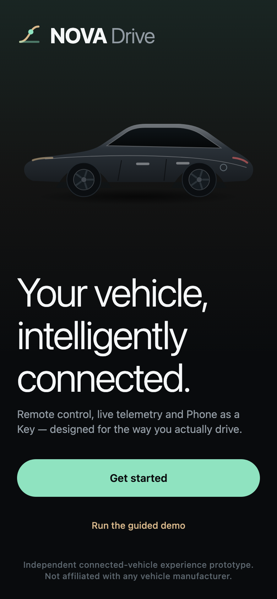 | 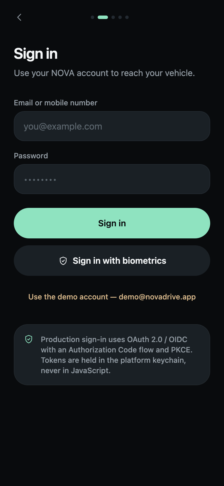 | 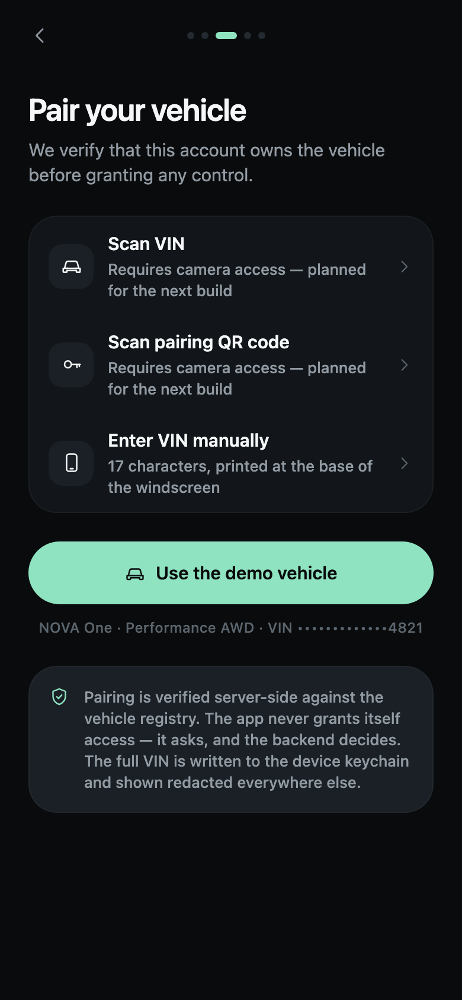 |

| Permissions | Digital Key invitation | Vehicle home |
|---|---|---|
| 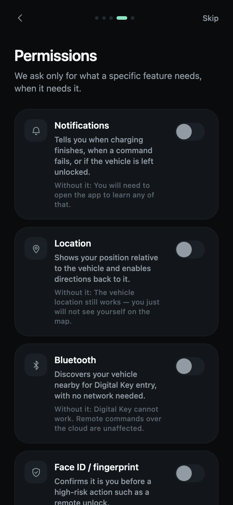 | 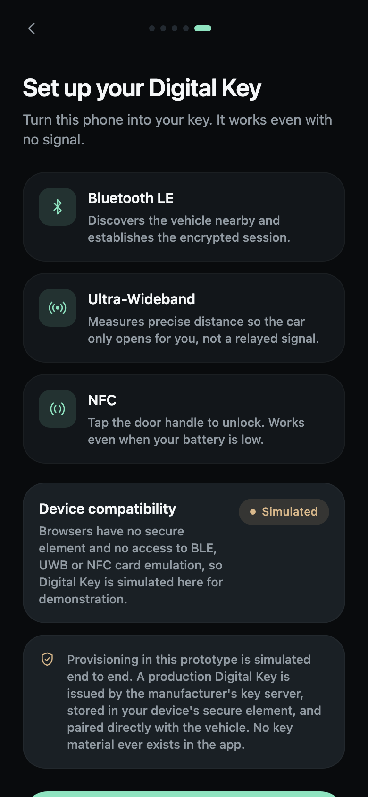 |  |

| Command in flight | Offline failure | Climate |
|---|---|---|
|  | 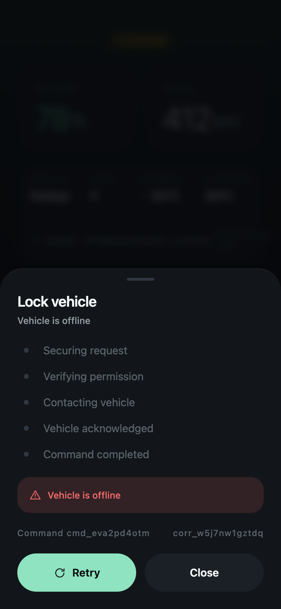 | 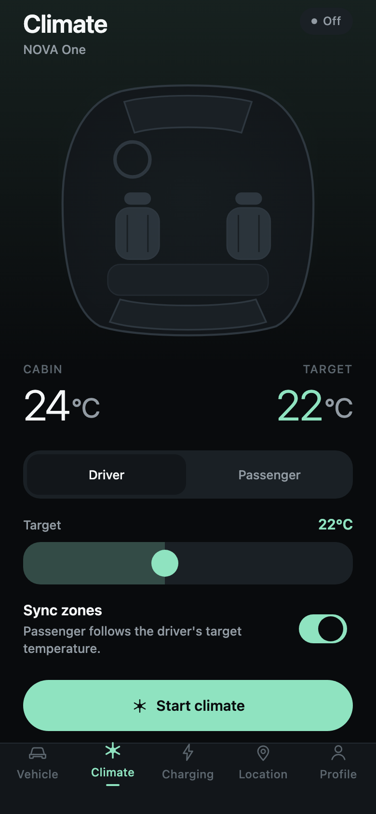 |

| Charging | Location | Digital Key |
|---|---|---|
| 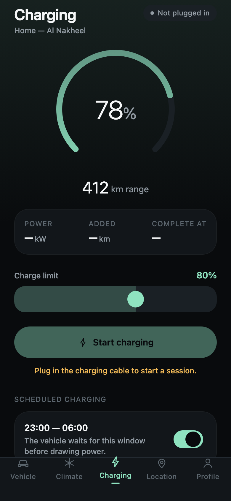 | 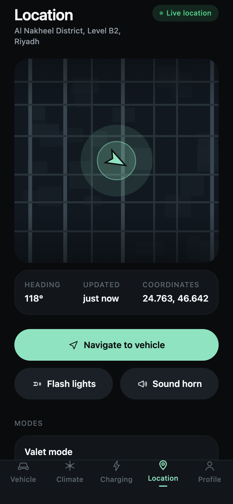 | 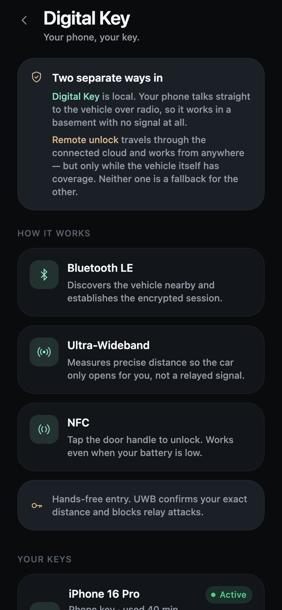 |

| Drivers & keys | Vehicle health | Software update |
|---|---|---|
| 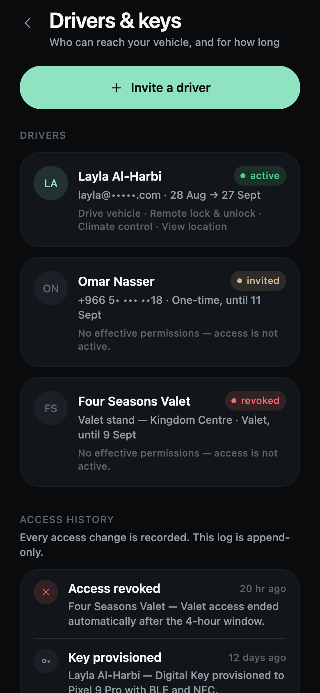 | 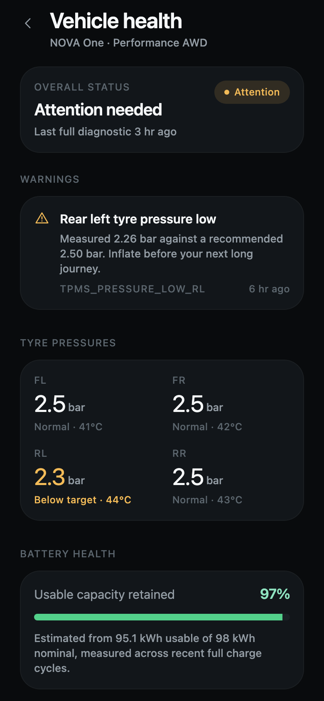 | 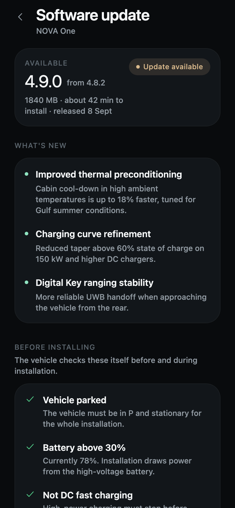 |

| Notifications | Security | Garage |
|---|---|---|
| 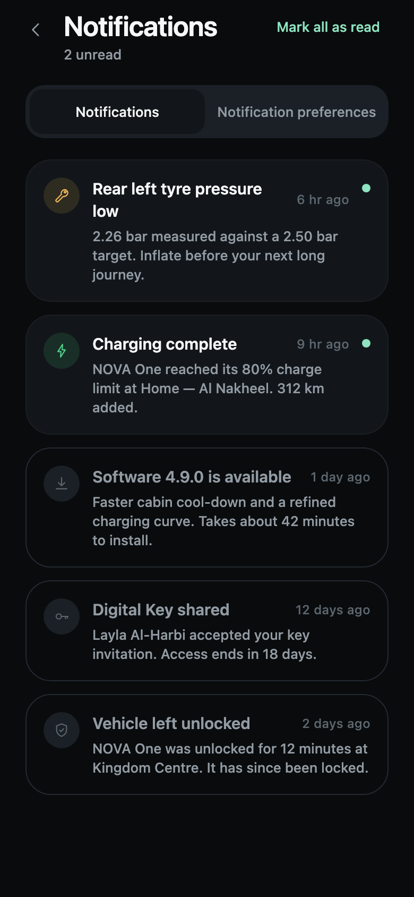 | 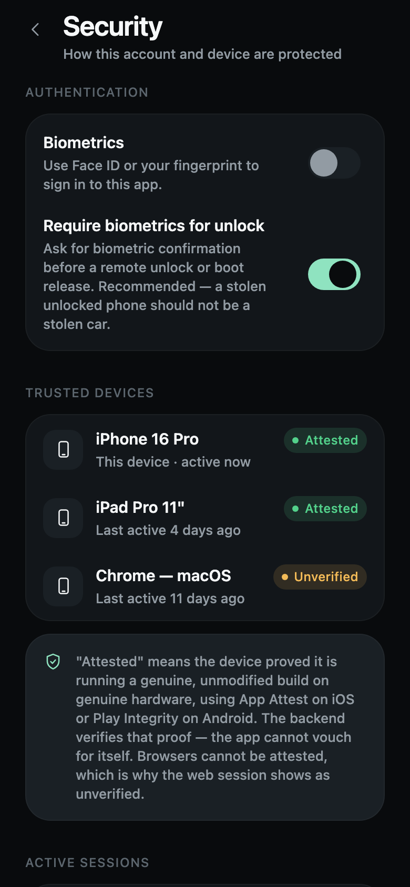 | 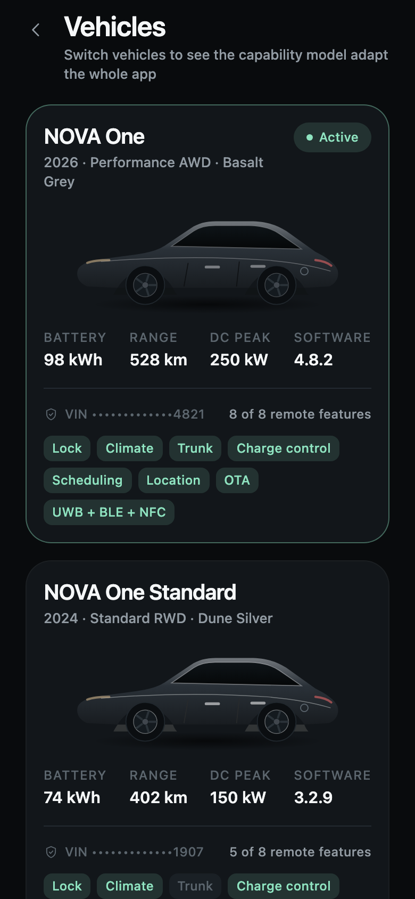 |

| Developer simulation | End-to-end trace | Arabic (RTL) |
|---|---|---|
| 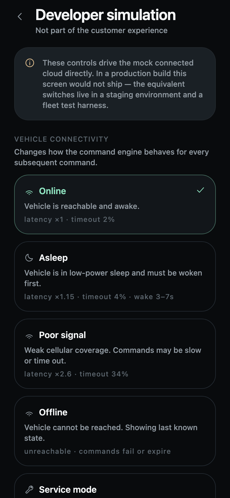 |  | 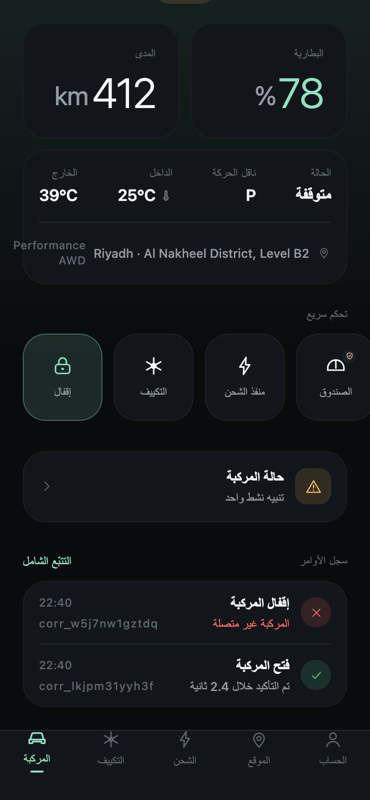 |

---

<p align="center">
  <sub><strong>Independent connected-vehicle experience prototype. Not affiliated with any vehicle manufacturer.</strong></sub>
</p>
