# Visual evidence

## The running app

`app/` holds screenshots of the **actual app running** — the exported web build
driven in headless Chrome by `tools/smoke-web.js`, at a 390×844 phone viewport,
with WebGL on SwiftShader. These are the real renderer, the real model and the
real command pipeline, not offline renders.

| | |
| --- | --- |
| 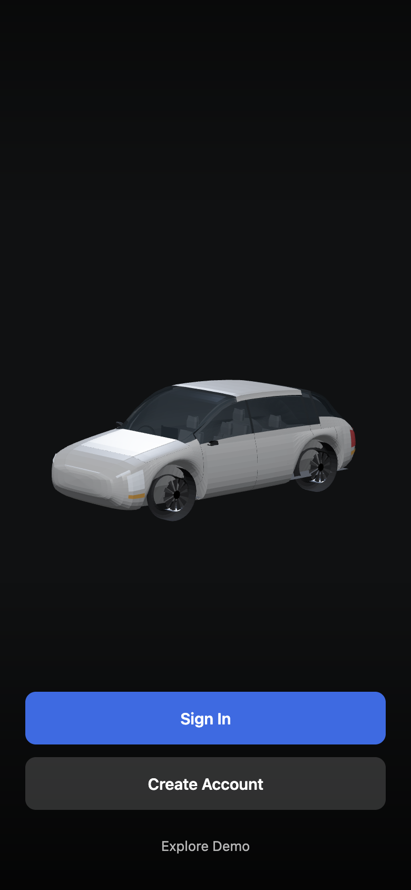 | **Welcome.** The vehicle itself, no wordmark, no presenter overlay. |
| 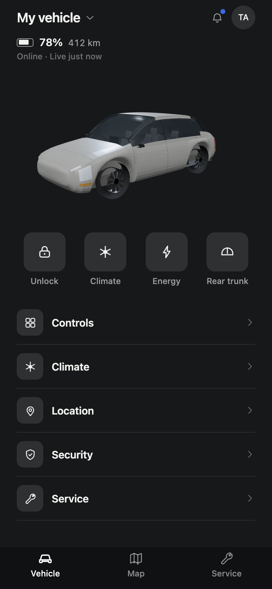 | **Home**, boot closed. Compact battery/range/connection line, four shortcuts. |
| 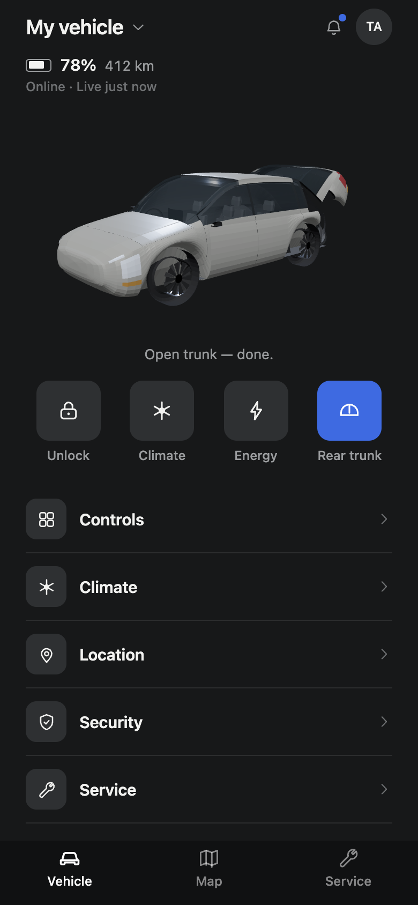 | **After "Rear trunk"** — the tailgate has physically swung open on its hinge and the shortcut is lit. The status line reads the command through. |
| 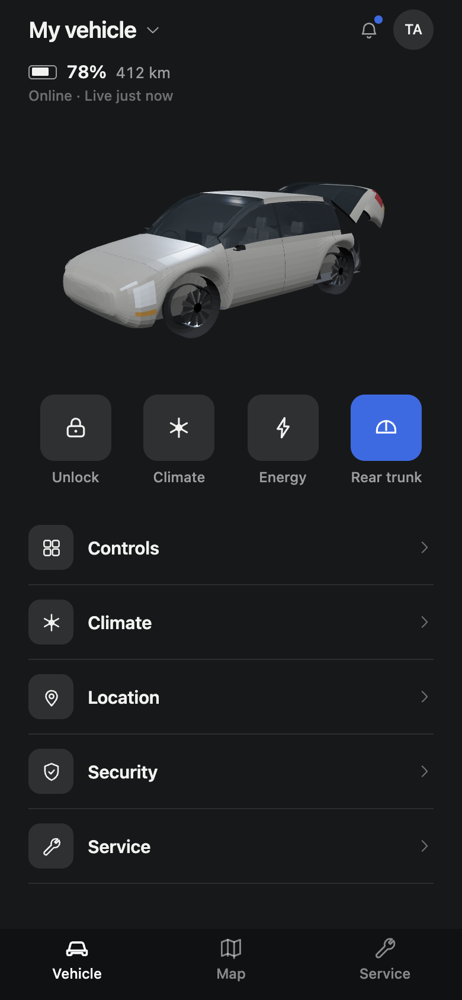 | Eight seconds later the outcome line has cleared on its own; the boot stays open. |
| 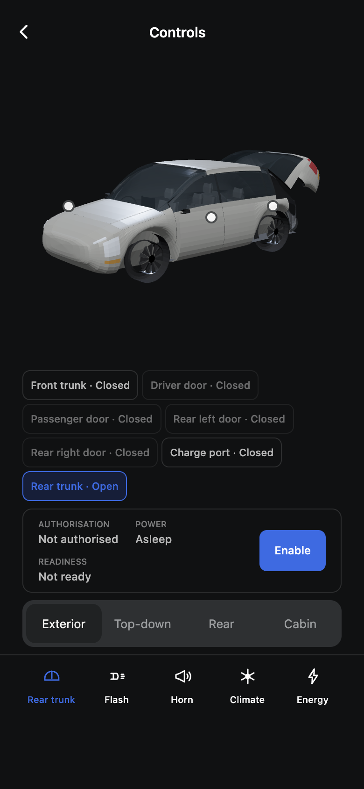 | **Controls.** Small anchored hotspots, no translucent pills, every part listed with its reported position. |
| 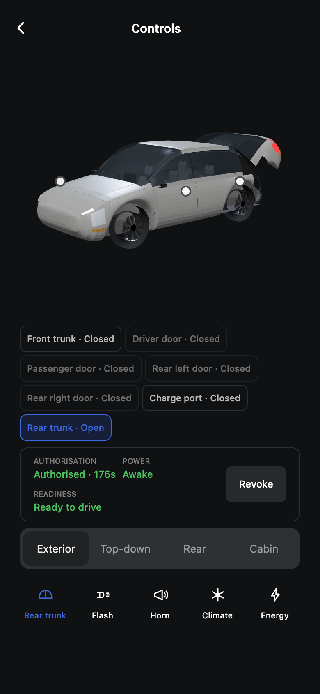 | **Drive authorisation.** Authorised · 176s / Awake / Ready to drive as three distinct states, with the running lights lit. Boot still open — state is consistent across screens. |

Navigating Home → Controls → back and finding the boot still open is visible
across these frames, which is the persistence requirement demonstrated in the
running app rather than only in a test.

## Articulation frames

Screen recording was not available in this environment, so each animated
behaviour is also shown as **sequential frames** rendered from the shipped asset
by `tools/preview_model.py`. That tool loads `assets/vehicle/vehicle.glb`, applies a
named hinge pose through the same articulation mapping the app uses
(`assets/vehicle/vehicle.articulation.json`), and rasterises it. The frames are
therefore produced by the real model and the real mapping — not mock-ups.

Interpolation between these poses is what the app animates at runtime: the
scene eases each panel toward its reported position at a fixed angular rate
(`PANEL_SPEED` in `src/components/vehicle-3d/VehicleScene.tsx`) and snaps when
the remaining travel is imperceptible.

## Rear trunk — opening

| 0% | 34% | 67% | 100% |
| --- | --- | --- | --- |
| 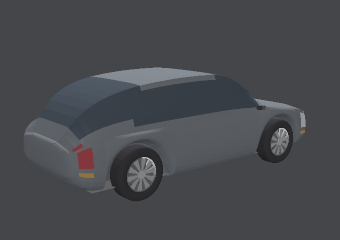 | 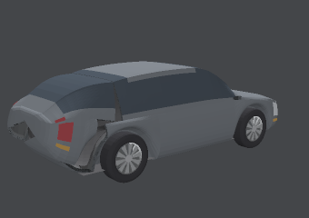 | 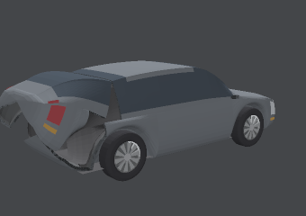 | 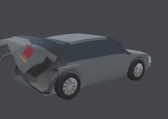 |

The tailgate rotates about the roof's trailing edge (X axis, pivot
`0, 1.512, −1.520`), sweeping up and rearward. The load bay behind it is solid
geometry — cabin shell and load floor — not an empty hole.

## Doors — opening

| 0% | 35% | 70% | 100% |
| --- | --- | --- | --- |
| 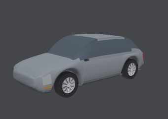 | 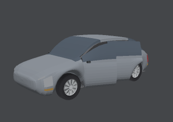 | 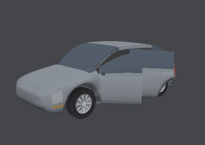 | 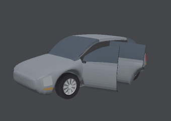 |

Front and rear right doors, hinged at the A- and B-pillars respectively, each
about its own vertical axis. Each door carries its own glass and mirror, has an
inner skin and a rim so it reads as a panel with thickness, and reveals the
cabin interior behind it.

## Front trunk and charge port

| Front trunk | Charge-port flap |
| --- | --- |
| 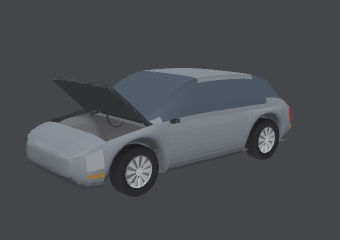 | 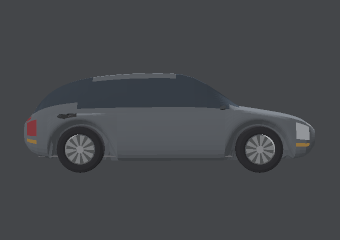 |

The bonnet hinges at the cowl and lifts from its leading edge. The charge flap
is on the left rear quarter and swings outboard about its rearward vertical
edge.

## Flash — actual light surfaces

| Unlit | Flashing |
| --- | --- |
| 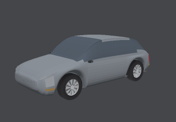 | 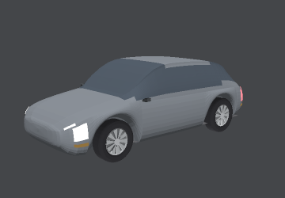 |

Flash drives the emissive intensity of the real head and tail lamp meshes for
the event's reported duration and then stops. It is additive over reported
lighting, so it cannot latch a light on — see the
`does not leave any light latched on after a flash` test.

## What is proven by test rather than by frame

Some required evidence is behavioural rather than visual, and is asserted
directly in the suite:

| Behaviour | Test |
| --- | --- |
| Open state persists across navigation | `trunk-vertical-slice.test.ts` |
| A delayed command moves nothing until confirmed | `trunk-vertical-slice.test.ts` |
| An offline command leaves the panel closed | `trunk-vertical-slice.test.ts` |
| An expired command is not re-sent | `trunk-vertical-slice.test.ts` |
| Drive authorization ≠ drive readiness | `vehicle-state-coordination.test.ts` |
| Horn/flash presented exactly once | `vehicle-state-coordination.test.ts` |
| Climate stays active while the boot is open | `vehicle-state-coordination.test.ts` |
| Unlocking opens no door | `vehicle-articulation.test.ts` |
